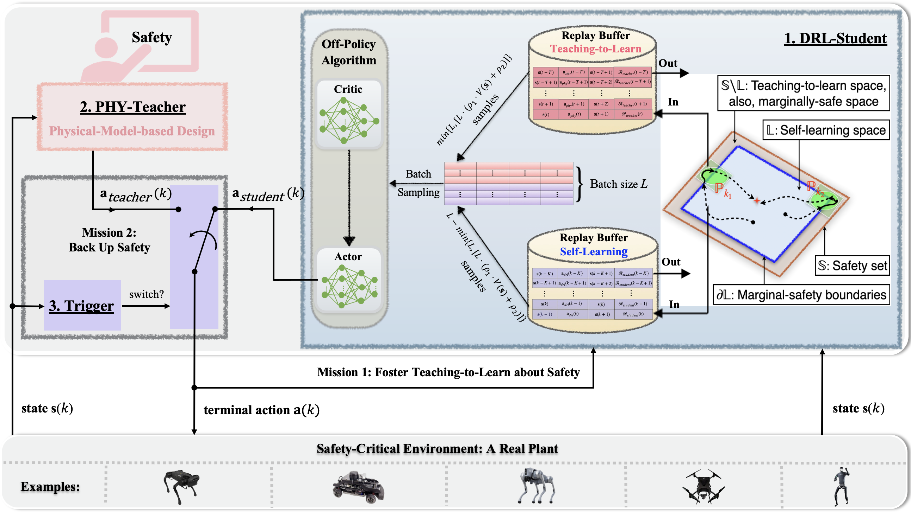
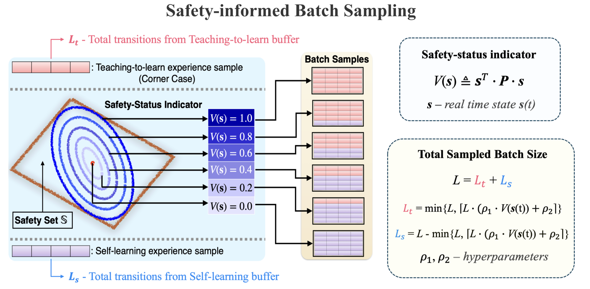

# NeurIPS 2025 - Real-DRL: Teach and Learn in Reality


This repo provides an implementation of the [Real-DRL](https://charlescai123.github.io/real-drl-website/) framework, with three different experiments:

* [Cart-Pole](./cartpole/): Cartpole System in Openai Gym
* [Real-A1](./real-a1): A1 Robot in Real-world Environment
* [Isaac-Go2](./isaac-go2/): Go2 Robot in Nvidia IsaacGym

<p align="center">
  
 <br><b>Fig 1. Real-DRL Framework</b>
</p>

<p align="center">
  
 <br><b>Fig 2. Safety-informed Batch Sampling</b>
</p>


## 📝 Citation

Please star or cite below papers if you find this repo helpful 🙏

```
@inproceedings{
      2025realdrl,
      title={Real-{DRL}: Teach and Learn in Reality},
      author={Yanbing Mao, Yihao Cai, Lui Sha},
      booktitle={The Thirty-ninth Annual Conference on Neural Information Processing Systems},
      year={2025},
      url={https://openreview.net/forum?id=gXZlZAeqay}
}
```

---