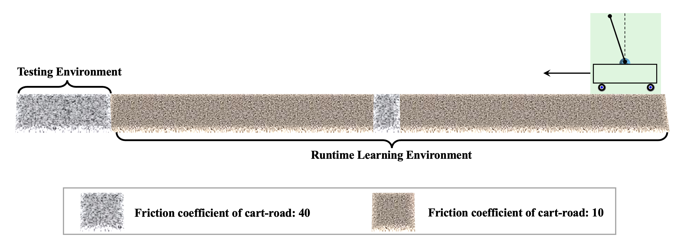
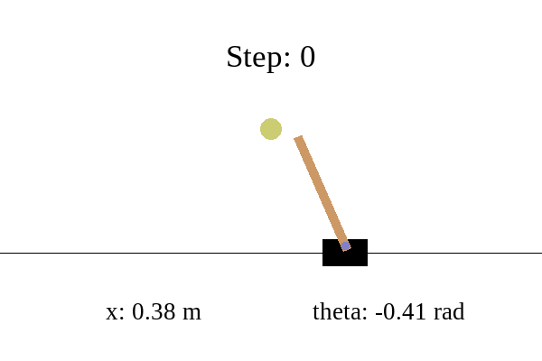
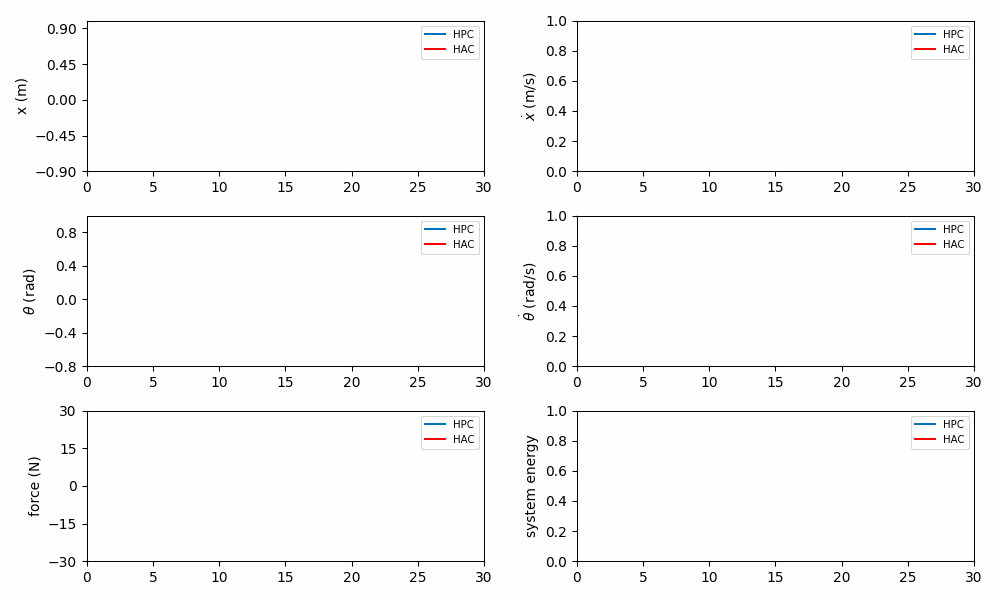

# Real-DRL: Experiment-Cartpole


---

This repository simulates the cart-pole system in Openai-Gym and implements the ablation studies to validate three
notable features of the **Real-DRL**. We use MATLAB to calculate solution of LMIs.

<p align="center">
  
 <br><b>Fig. Corner cases in Cartpole System</b>
</p> 

<!-- ## Table of Content

* [Code Structure](#code-structure)
* [Environment Setup](#environment-setup)
* [Experiment](#pretrain-a-policy)
    * [Pretrain a Policy](#pretrain-a-policy)
    * [Continual Learning](#continual-learning)
    * [Results]()
* [Misc](#misc) -->

<!-- --- -->

## Code Structure

In the codebase, [Hydra](https://hydra.cc/) is utilized for configuring hyperparameters in YAML style. The structure is
formatted as follows:

```
├── config                                <- Configure files (safety-set, learning space)
├── results   
│      ├── hydra                          <- Hydra log for each runtime
│      ├── logs                           <- Logs for training/testing/evaluation
│      ├── models                         <- Trained weights files
│      └── plots                          <- Plots for cartpole phase/trajectory
├── scripts                              
│      ├── test                           <- For testing
│      └── train                          <- For training
├── src                              
│    ├── envs                             <- Environment of the physical plant (cartpole)
│    ├── phy_teacher                  
│           ├── matlab                    <- m files for solving LMIs
│           ├── phy_teacher.py            <- Physical-model-based Teacher
│           └── mat_engine.py             <- Matlab engine interface
│    ├── drl_student                               
│           ├── agents                    <- DRL agent (DRL-Student)
│           ├── networks                  <- Phy-DRL network structure
│           └── ...                 
│    ├── runner.py                        <- Training/Testing/Evaluation loop                               
│    └── physical_design.py               <- Physical matrix design for cartpole     
├── main.py                               <- Main file
└── requirements.txt                      <- Depencencies for code environment                      
```

## Environment Setup

It is recommended to create a conda environment for development. The required packages have been tested under Python
3.9, though they should be compatible with other Python
versions.

### Python Package

Follow the steps below to build the Python environment:

1. First, download the appropriate version of [Anaconda](https://www.anaconda.com/download/success). After installation,
   create a virtual environment:
   ```bash
   conda create --name cartpole python==3.9.5
   ```
2. Second, activate the conda environment you created:
   ```bash
   conda activate cartpole
   ```
3. Finally, install all dependent packages by running:

   ```bash
   pip install -r requirements.txt
   ```

### Matlab Interface

The LMIs need MATLAB for computation. Please install [MATLAB](https://mathworks.com/downloads/) and check
the [requirements](https://www.mathworks.com/support/requirements/python-compatibility.html) to ensure your python
version is compatible with the installed matlab version. After that, build MATLAB Engine API for Python:

1. Find the folder under matlab root path:
   ```bash
   cd <matlab_root>\extern\engines\python
   ```

2. Use pip to install:
   ```bash
   python -m pip install .
   ```

## Experiment

### Pretrain a Policy

---

Pretrain a policy in an environment with some domain randomization employed:

   ```bash
   bash scripts/train/pretrain-drl.sh
   ```

You can observe the training status using tensorboard:

   ```bash
   tensorboard --logdir ./results/logs
   ```

To test the pre-trained policy, run command:

   ```bash
   bash scripts/test/pretrain-drl.sh
   ```

The cartpole system will safely converge to the set point with well-trained policy:
<p align="center">
  
 
 <br><b>Fig. A Well-trained Agent Provides Safety and Stability</b>
</p>


### Three Notable Features

---

#### 1. Teaching-to-Learn Mechanism

PHY-Teacher's experience transitions facilitate the fast learning and convergence for DRL-Student. To validate, run:

   ```bash
   bash scripts/<train|test>/teaching_to_learn/teaching_<to|wo>_learn<xxx>.sh
  ```

Here `<train|test>` specifies training or testing mode. `<to|wo>` indicates whether to use (`to`) or to exclude (`wo`) the PHY-Teacher's experience. `<xxx>` denotes different random initial states.

#### 2. Safety-informed Batch Sampling

The **safety-informed batch sampling** draws samples from a dual replay buffer according to the system’s safety status, emphasizing corner cases to mitigate data imbalance during learning. To validate it, run:
   ```bash
   bash scripts/<train|test>/safety_informed_batch_sample/real_drl_<dual|solo>_buffer.sh
  ```

Here `<train|test>` specifies training or testing mode. `<dual|solo>` indicates whether to use dual (safety-informed) or solo buffer.

#### 3. Automatic Hirearchical Learning

Real-DRL enables **Automatic Hierarchical Learning**: the DRL-Student first learns a safety-prioritized policy and then a high-performance task policy. As training proceeds, the decreasing activation ratio of the PHY-Teacher reflects the DRL-Student’s growing independence. To validate, run:

   ```bash
   bash scripts/<train|test>/hierarchical_learning/dual_buffer_hierarchical_<xxx>.sh 
  ```

Here `<train|test>` specifies training or testing mode. `<xxx>` indicates different random initial states.


## Misc

- To plot cartpole `phase/trajectory` or live show its `animation/trajectory`, check the fields
  in `config/logger/logger.yaml`
- Choose between training by `steps` or `episodes`, set field `training_by_steps` to *true* or *false*
  in `config/base_config.yaml`
- The repository uses the `logging` package for debugging. Set debug mode in `config/base_config.yaml`
- In case you get issues during live plot, check the suitable
  backend [libraries](https://matplotlib.org/stable/users/explain/figure/backends.html) to use for matplotlib and set it
  by *matplotlib.use(xxx)* in `src/logger/live_plotter.py`