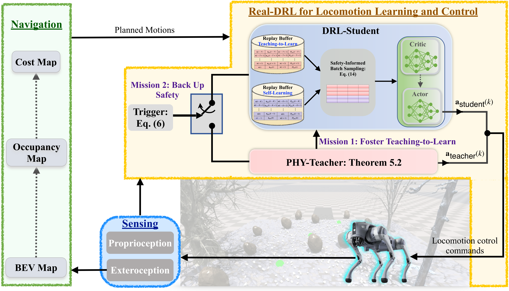
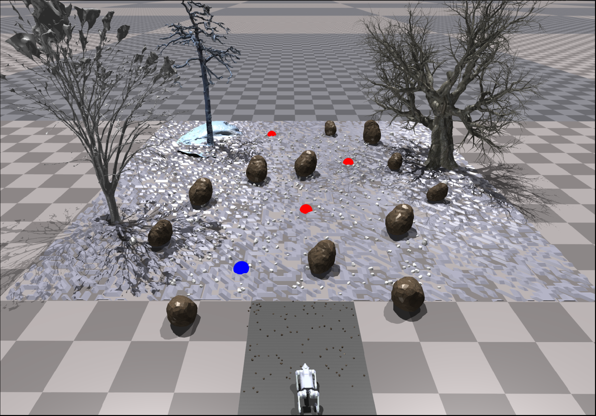
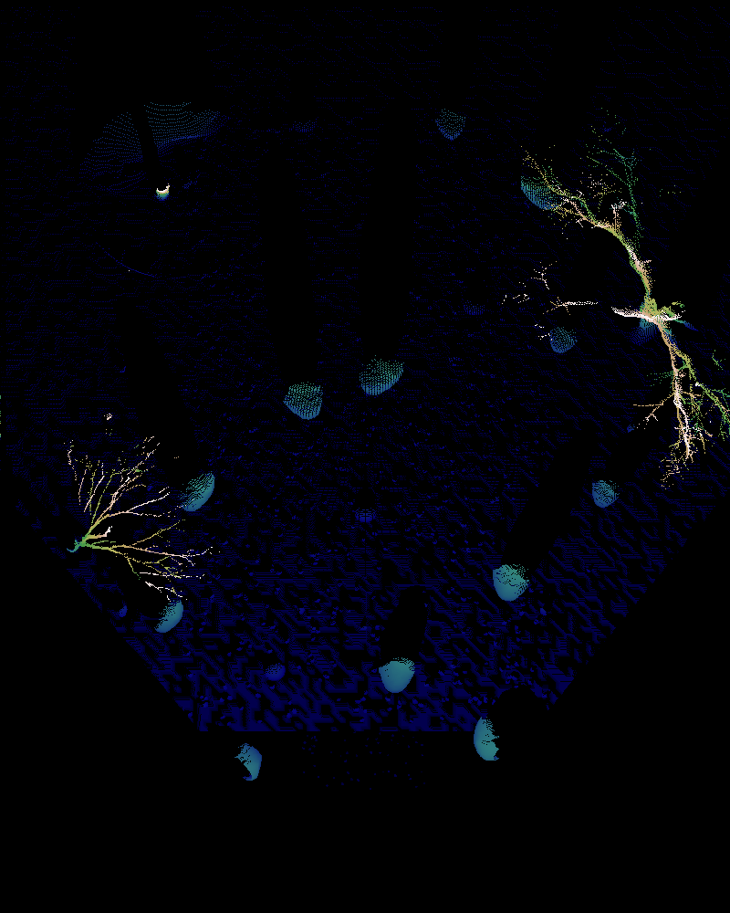
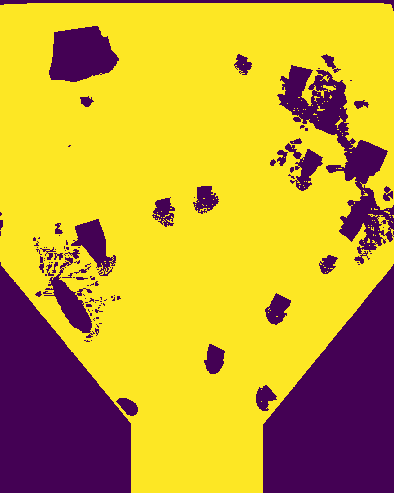
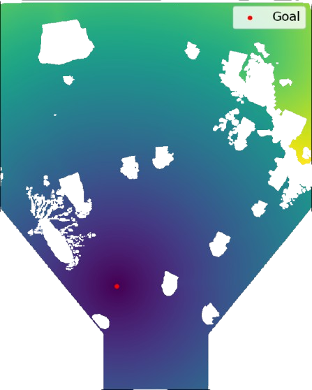
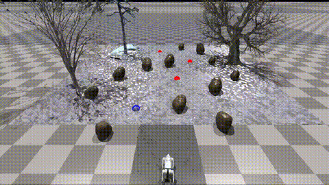
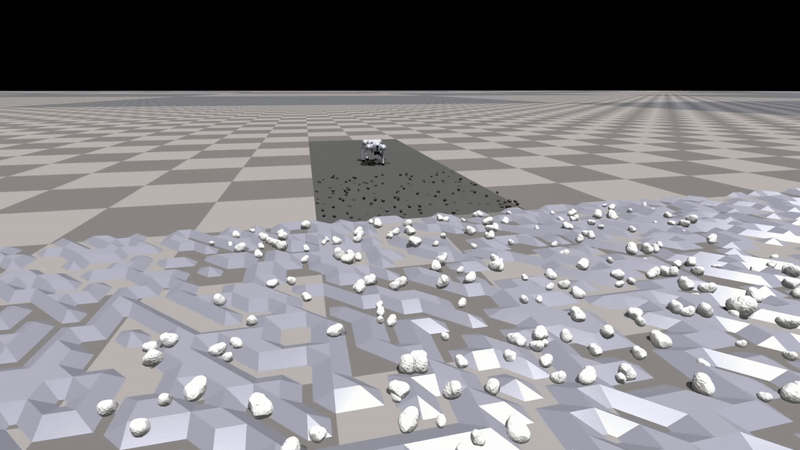

# Real-DRL: Experiment-Go2 (Wild Environment)


---

This repo implements the **Real-DRL** on the Unitree-Go2 robot for the wild environments in Nivida IsaacGym. In this framework, a closed-loop system is established for the quadruped robot by incorporating the *Sensing*, *Navigation/Planning* and *Locomotion Control* module.
<p align="center">
  
 <br><b>Fig 1. Runtime Learning Framework -- A Close-loop System for the Quadruped Robot</b>
</p>

## 💡 User Guide

### ⚙️ Dependencies

* *Python - 3.8 or above*
* *PyTorch - 1.10.0*
* *Isaac Gym - Preview 4*

### 🔨 Setup

1. Clone this repository:

```bash
git clone git@github.com:Charlescai123/isaac-wild-go2.git
```

2. Create the conda environment with:

```bash
conda env create -f environment.yml
```

3. Activate conda environment and Install `rsl_rl` lib:

```bash
conda activate isaac-wild
cd extern/rsl_rl && pip install -e .
```

4. Download and install IsaacGym:

* Download [IsaacGym](https://developer.nvidia.com/isaac-gym) and extract the downloaded file to the root folder.
* navigate to the `isaacgym/python` folder and install it with commands:
* ```bash
  cd isaacgym/python && pip install -e .
  ```
* Test the given example (ignore the error about GPU not being utilized if any):
* ```bash
  cd examples && python 1080_balls_of_solitude.py
  ```

5. Build and install the interface to Unitree's SDK:

* First, install the required packages `Boost` and `LCM`:

   ```bash
   sudo apt install libboost-all-dev liblcm-dev
   ```

* Then, go to `extern/go2_sdk` and create a build folder:
   ```bash
   cd extern/go2_sdk
   mkdir build && cd build
   ```

  Now, build the libraries and move them to the main directory by running:
   ```bash
   cmake ..
   make
   mv go2_interface* ../../..
   ```

## Runtime Learning in the Wild

[//]: # (<p align="center">)
[//]: # (  )

### 📍 Navigation

**Map Generation Pipeline:** Exterioception (Depth) ➡ BEV Map ➡ Occupancy Map ➡ Cost Map

| BEV Map                                      | Occupancy Map                                      | Cost Map                                     |
|----------------------------------------------|----------------------------------------------------|----------------------------------------------|
|  |  |  |

The quadruped robot navigates through the wild environment alongside all the waypoints:

```bash
python -m src.scripts.play --use_gpu=True --show_gui=True --num_envs=1
```

| Navigate in the Wild          | RGB Camera Image                           | Depth Camera Image                          |
|-------------------------------|--------------------------------------------|---------------------------------------------|
|  |  |  |

### 🦿 Locomotion

---


The locomotion control module provides real-time response in safety-critical systems, effectively
handling unforeseen incidents arising from unknown environments.


#### 1️⃣ Safety Assurance (Runtime Learning)

A key objective of this framework is to ensure the robot's safety during runtime learning, achieved through a
hybrid control system with a switching mechanism design:

🔹 when the robot base turns **Blue** ➡️ robot is controlled by **DRL-Student**.

🔺 when the robot base turns **Red** ➡️ robot is controller by **PHY-Teacher**.

| With Runtime-Learning Framework                         | Without the Framework                                 |
   |---------------------------------------------------------|-------------------------------------------------------|
|  |  |

#### ️2️⃣ **Compare with Other Model-based Controller**

PHY-Teacher is a real-time, physics-based safety controller utilizing a dynamic model (**Real-Time Patch**), holding
superior performance compared to safety controllers that rely on time-invariant (e.g., **Fixed**) models. The comparison
on wild, uneven terrain is demonstrated:

| Real-Time Patch (under random push)                         | Fixed Robot Model                                          |
|-------------------------------------------------------------|------------------------------------------------------------|
|  |  |


## 🏷️ Misc

- In order to plot the latest saved trajectory, run command `python -m src.utils.plot_trajectory`
